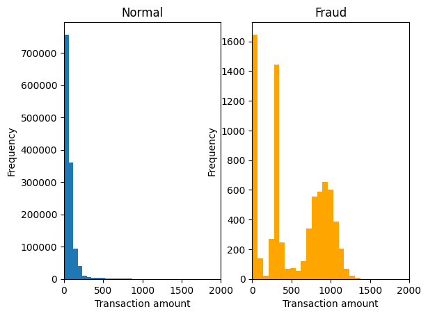
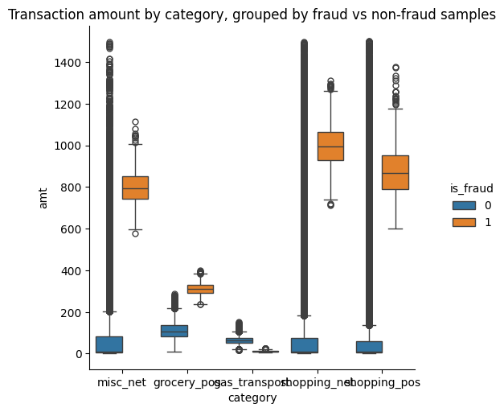
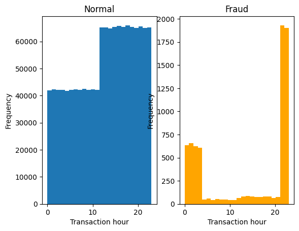
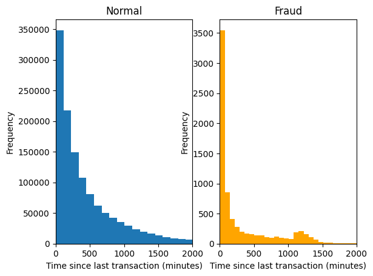
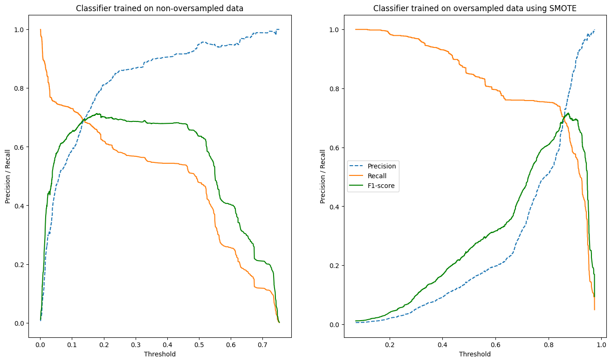
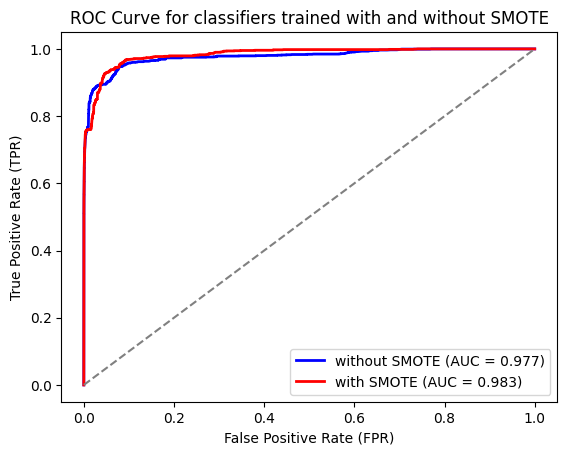

# Credit fraud detection mini-project

This is a small personal project centred around building a simple, scalable machine learning model to predict occurrences of credit card fraud.

The training dataset can be found on Kaggle here: https://www.kaggle.com/datasets/kartik2112/fraud-detection?select=fraudTrain.csv. It's based on a simulated transaction data, so the data isn't confidential.


# Local setup

## Model training

To train the model locally, follow the following steps:

1. Create a virtual environment and install dependencies. On Linux-based machines, the standard commands are as follows:

```
python -m venv .venv
source .venv/bin/activate
pip install -r requirements.txt
```
You may also wish to install the development requirements `requirements_dev.txt` to run unit tests.

2. Download the above training dataset and place it in the `\data` folder. Make sure it is named `fraudTrain.csv`.

3. Run the following command to train a random forest model with the default tuned hyperparameters. This should generate a file `rf_model_final.pkl` in `\models`.

```
python src/train.py
```
4. Making a prediction. I created simple API using FastAPI that serves predictions given 

## Unit tests

To run unit tests with pytest, run

```
pytest
```

The unit tests are run on mocked data as opposed to real data. 

# Explanatory notes

## Feature selection

After exploratory analysis of the data, I chose to incorporate the following existing features:

- Transaction amount. As per the following histograms, fraudulent transactions are can be excessively large or small relative to regular transactions. I've also plotted the differences grouped by transaction category.





- Hour of the transaction. This is an integer from 0 to 23 representing the hour of day of the transaction. The following histograms indicate that fraudulent transactions can occur at more unusual hours.



- Transaction category (one-hot-encoded). I found that fraudulent transactions are more likely to occur for specific transaction types, such as online shopping. 

In addition, I also engineered the following features:

- Time (in minutes) since the last transaction by the same card number. As per the figure below, it seems like fraudulent transactions are more likely to occur at regular intervals as the small peak near 1100 minutes in the right histogram indicates.



The numerical features are scaled to zero mean and unit variance, while the categorical feature (transaction category) is one-hot encoded. Missing values are imputed using the median for numerical features and using the mode for the categorical feature.

As we are expecting a non-linear decision boundary for some of the features, such as transaction amount (where unusually low OR high amounts can indicate fraud), I decided to use a random forest model. This has the added benefit of being interpretable, as feature importances can be derived (this is based on the average entropy change on splitting using a particular feature).


## Handling class imbalance

The training set is highly unbalanced. Only around 0.6% of the samples are fraudulent. 

I investigated the impact of applying the Synthetic Minority Over-sampling Technique (SMOTE) to the training data. This is a method of over-sampling the minority (fraud class) class using linearly-interpolated artificial data belonging to the minority class. 

I trained two separate random forest classifiers using the same default hyperparameters, where one with the oversampled data and one without. The precision-recall as a function of the threshold probability and and the ROC curves of these two classifiers are shown below:




The classifier trained on the oversampled data achieves a slightly higher maximal F1-Score at a threshold probability of around 0.87. The area under its ROC curve is also slightly higher. In the end, based on this analysis, I decided to keep oversampling as one of the preprocessing steps.


